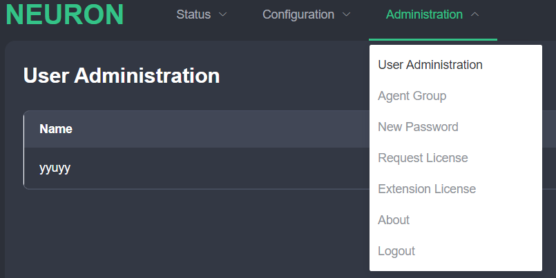

# 整体布局 
这是进入 Neuron 后显示的第一个画面。在上半部分，有一个菜单选择栏，其中包含 3 种功能。首先是状态菜单，包含数据、事件、报警监控功能。第二个菜单是配置菜单，用于设置 PLC 或设备的通信细节。最后是管理菜单。右上角有三个命令按钮，用于控制 Neuron 系统。下方是状态栏，用于显示 Neuron 的当前状态。

## 选择菜单

**状态菜单**

**配置菜单**

**管理菜单**

## 命令按钮 
右上角有 3 个命令按钮来控制 Neuron。

<table>
  <tr>
    <td>启动/停止</td>
    <td>这是一个启动/停止按钮，可以暂时暂停 Neuron。当 Neuron 暂停时。系统状态将转为待机模式，不会发送遥测数据。</td>
  </tr>
  <tr>
    <td>重启</td>
    <td>此按钮用于重新启动 Neuron 系统。</td>
  </tr>
  <tr>
    <td>发送</td>
    <td>该按钮用于完成设置配置数据后，将配置数据发送至 Neuron 系统。</td>
  </tr>
</table>

## 状态栏 
Neuron 中的系统状态有五种。

| 状态                                  | 描述                                                                                                         |
| ------------------------------------- | ------------------------------------------------------------------------------------------------------------ |
| COMM UP COMM DOWN                  | PLC/设备通讯向上  PLC 设备通讯中断                                                                        |
| MANU AUTO SERV                  | 手动模式下的 MANU 机器 自动模式下的 AUTO 机器 伺服机处于服务模式                                       |
| ACTIVE INACTIVE STANDBY SEMI | Neuron 系统处于活动模式 Neuron 系统处于非活动模式 Neuron 系统处于待机模式 Neuron 系统处于半主动模式 |
| MQCONNECT MQDISCONNECT             | MQ 服务器已连接 MQ 服务器已断开连接                                                                       |
| NO ALARM ALARM UNACK ALARM      | 没有发现警报 警报  未确认的警报                                                                        |
