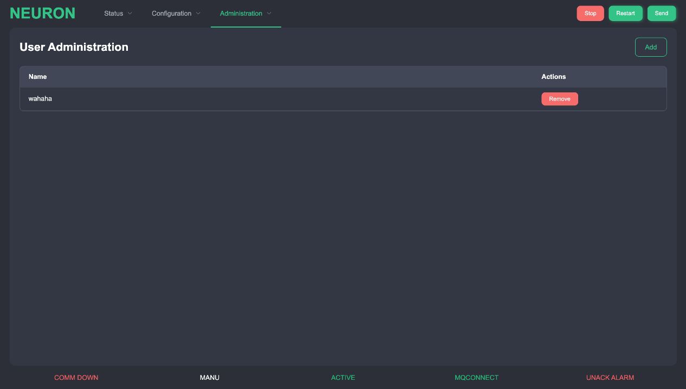
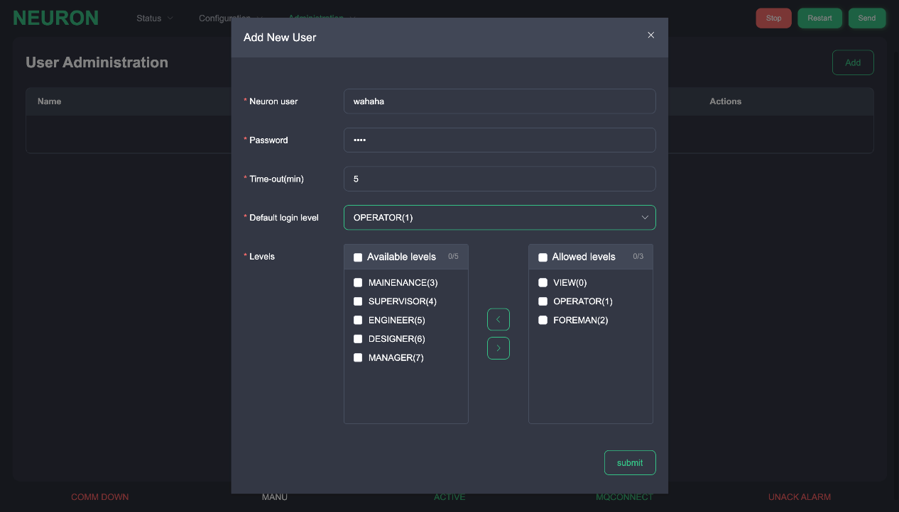
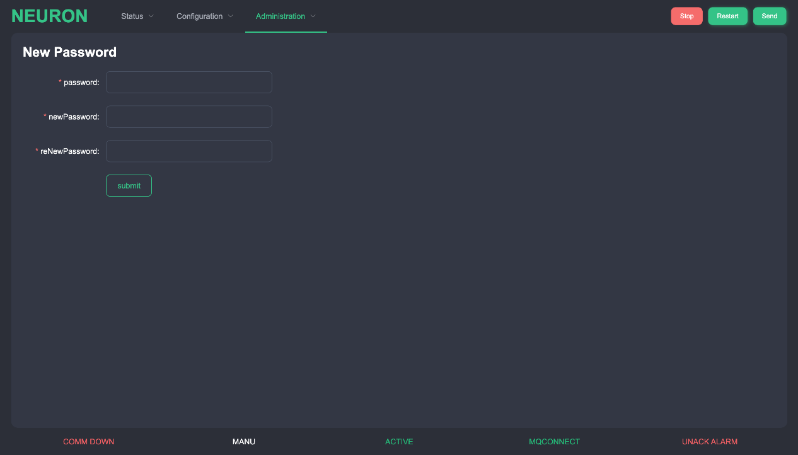

# 用户管理 
Neuron 允许多用户使用。每个用户都有自己的密码，并有自己的访问级别，访问级别是用户在 Neuron 中可以执行的访问权限的集合，系统管理员可以为 Neuron 分配这些权限。这些访问级别不一定要按顺序排列。用户可以在任何时候将其访问级别降低到较低的访问级别，之后再提高。Neuron 的每个功能都有一组有效的访问级别。

创建用户时，系统管理员选择一个用户名，并分配一个密码。用户以后可以修改密码。此外，还可以设置以分钟为单位的超时时间。这个超时时间的目的是，如果用户在登录后，没有触摸键盘，则访问级别将被设置为 0（查看）。那么，要想获得更高的访问级别，操作者就必须使用自己的密码，提高其访问级别。在任何时候，如果用户没有将访问级别设置为当前功能所需的级别，但有权限更改到所需的访问级别，Neuron 会要求输入密码。然后输入正确的密码后，用户将获得临时访问本功能的权限。退出该功能后，如果要再次进行同样的操作，用户必须提高访问级别或再次输入密码。如果发生超时，这个临时访问也将不再有效。

有一个预定义的用户，(admin)，它和 Neuron 管理员一样。超级用户在交付时已将其密码设置为默认值，出于安全考虑，应在安装后更改密码。正常情况下，不应该有人以超级用户的身份登录运行 Neuron，只有在做管理任务时才应该这样做。

## 用户设置 
此页面用于管理用户。按 "添加" 按钮可添加用户。要删除用户，按 "删除" 键可删除当前行。

按下 "添加" 按钮后，将显示 "添加新用户" 对话框。输入名称和密码。选择该用户的访问级别。

## 新密码 
该功能提供了更改当前登录用户密码的可能性。

